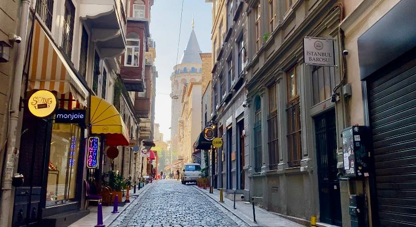
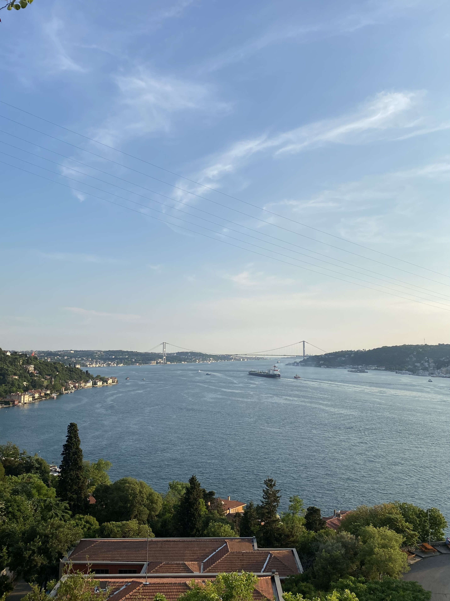
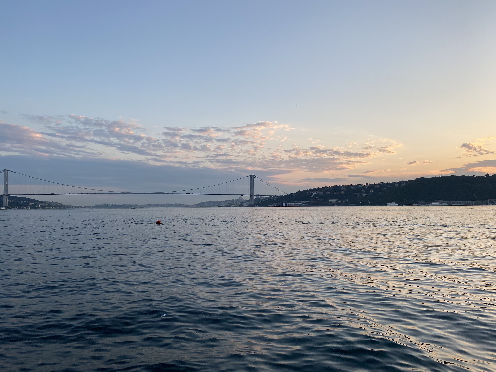

<h1>
Alara's World
</h1>

  
<h2>Hello there! Welcome to my personal website. Get ready for a fun adventure!!</h2>

<h2>So, let me introduce myself. I'm Alara and I'm from Istanbul. The picture above is from one of my favorite neighborhoods in the city, called Galata. The tall monument is called Galata Tower, and is a historical landmark.</h2>

 
 

<h2>Istanbul is a city of history, art, food, architecture, and nature. This metropolitan city connects tow continens: Europe and Asia.</h2>

<h2>While I enjoy walking around and taking in the beuty of Istanbul, I should definetely mention Turkish food. While Kebap is the first thing that comes into mind, there are many other traditional Turkish dishes that are well appreciated by its citizens.</h2>

  
