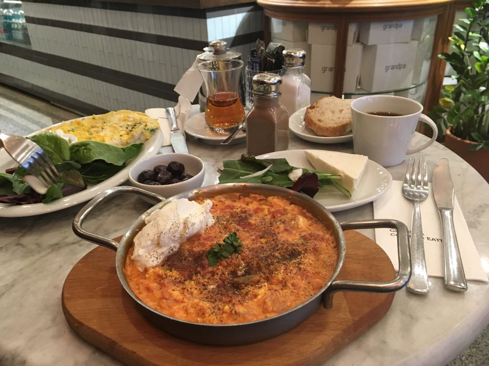
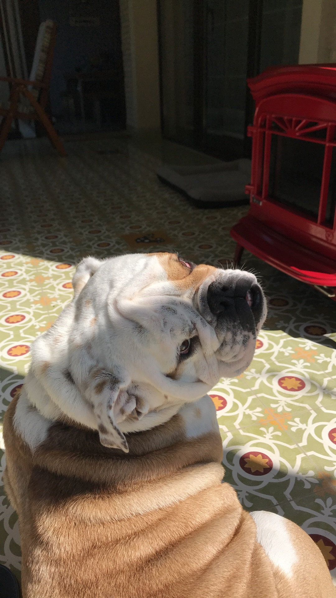
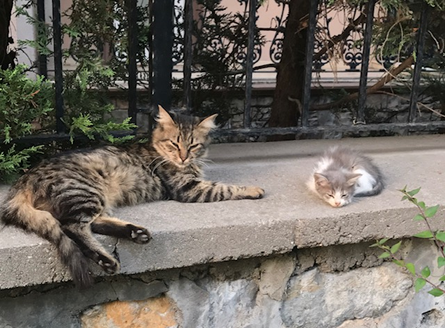
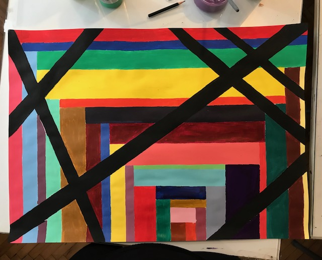
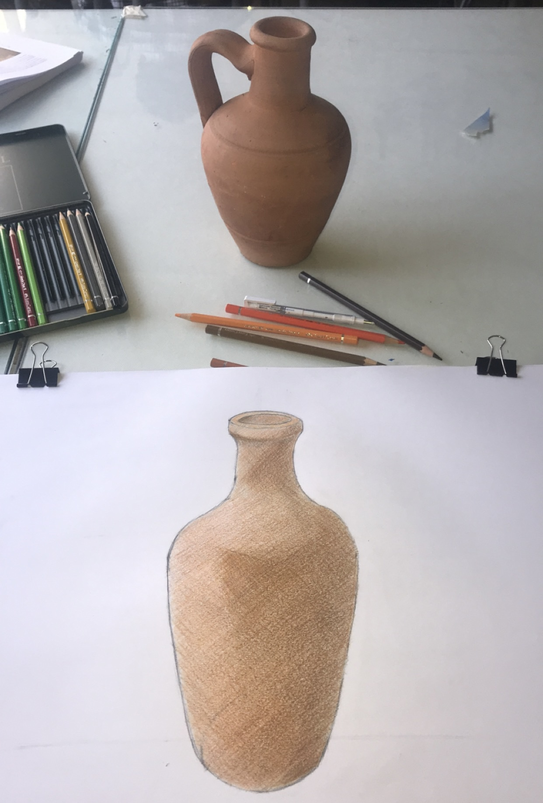

  
<h2>
Hello there! Welcome to my personal website. Get ready for a fun adventure!
</h2>

<h3>
So, let me introduce myself. I'm Alara and I'm from Istanbul. The picture above is from one of my favorite neighborhoods in the city, called Galata. The tall monument is called Galata Tower, and is a historical landmark.
</h3>

<h3>
Istanbul is a city of history, art, food, architecture, and nature. This metropolitan city connects tow continens: Europe and Asia.
</h3>

  
<h3>
While I enjoy walking around and taking in the beuty of Istanbul, I should definetely mention Turkish food. While Kebap is the first thing that comes into mind, there are many other traditional Turkish dishes that are well appreciated.
</h3>

  

<h3>
For example, breakfast has an important role in my culture. My favorite breakfast dish "Menemen", which is a combination of eggs, tomato, green peppers, and spices (shown in the picture above).
</h3>

  
<h3>
Next, Turkish coffee plays a significant role in social interactions. There is a common saying that emphasizes how important it is to make a good Turkish coffee: "A cup of coffee is remembered for 40 years", so everyone is taught how to prepare one from early age.
</h3>

Photo Credit: Ahmed Aqtai

<h3>
Lastly, Baklava is a very famous desert that has both religious and cultural roots. It has many layers of dough, sometimes over 30, which requires many hours of labor. It is common to find Baklava in every Turkish restaurant but is very difficult to prepare it at home.
</h3>

Photo Credit: Ekrulila

<h3>
Since we have established how much I like Turkish food, we can move on to other aspects of my life. Meet Boris, he is my uncle's Bulldog, and my one and only love in this world.
</h3>

<h3>
One thing about me is that I love animals. I have fed many stray cats during my upbringing, and I adopted one of them recently. Introducing Fluffy, the smartest cat I have encountered, and her baby Smoke.
</h3>

 

<h3>
Moving on to my passions, I really like painting. I find art to have a therapatic effect on me, so I try to spend as much of my free time on painting, drawing, or visiting museums. 

